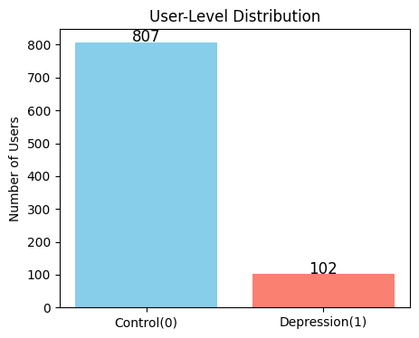

# Early-Risk-Prediction-Log

# Problem Definition：

eRisk 2025 shared task 2 focuses on detecting early signs of depression by analyzing full conversational contexts. Unlike previous tasks that focused on isolated user posts, this challenge considers the broader dynamics of interactions by incorporating writings from all individuals involved in the conversation. Participants must process user interactions sequentially, analyze natural dialogues, and detect signs of depression within these rich contexts. Texts will be processed chronologically to simulate real-world conditions, making the task applicable to monitoring user interactions in blogs, social networks, or other types of online media.

[https://erisk.irlab.org/2025/index.html](https://erisk.irlab.org/2025/index.html)

# Research Problems

How early can we reliably detect depression from longitudinal Reddit posting behaviour, and are these temporal linguistic signals—such as PHQ-9 item-level similarity trajectories, LIWC affective (positive/negative), cognitive processing, social orientation, pronoun usage patterns, LSM conversational alignment, relative-entropy fluctuation across posts, and target–parent cosine similarity predictive of early depression onset at the user-level?

# Data

Dataset is provided by eRisk 2025 shared task 2

This task uses the dataset provided by the eRisk 2025 Shared Task 2. It combines data from previous eRisk challenges in 2017, 2018, and 2022. It consists of writings including posts and comments collected from selected Reddit users.

A total of 909 users are included, divided into two groups: individuals suffering from depression and control users. Many writings from depressed users were gained from mental health–related subreddits such as depression, while control users were picked from various general topic subreddits.

For each user, the dataset contains a chronologically ordered sequence of writings from that user, along with messages from other participants in the same conversation.

Two types of instances are provided: Submissions (the primary posts created by users) and Comments (replies to submissions or to other comments). Table 2 illustrates the structure of these entries.

The ground truth labels (whether a user belongs to the depression or control group) were determined based on self-reported mentions in Reddit posts (e.g., "In 2013, I was diagnosed with depression") and then manually inspected by researchers for agreement.

| Attribute | Submission Example | Comment Example |
| --- | --- | --- |
| type | submission | comment |
| user_id | subject_VWwmnNO  | subject_VWwmnNO |
| target | fals | fals |
| title | HS Scars – how to treat? | ---  |
| body | ``Hi, everyone!...'' | ``glycolic acid...'' |
| created_utc | 2024-05-08 02:55:38 | 2024-05-08 08:14:19 |
| submission_id | goOnrJ1 | goOnrJ1 |
| parent\_id | ---  | goOnrJ1 |
| comment_id  | ---  | MzFuoZB |

## Data Distribution :



Split data into train set (80%) and test set (20%) — user level. Randomly remove some control’s post in both set to keep data more balance.


# Baselines

## LSM

Method:

- Pair each user’s comment (target) with the parent post it replies to.
- Extract LIWC features for both target and parent.
- Compute LSM-based interpersonal alignment across dimensions including social orientation, positive/negative affect, first-person and other pronoun use, cognitive and perceptual processes.
- Use these LSM similarity features as predictive signals for identifying whether a target user is depressed.

Features:

```python
'LSM_mean', 'social_mean', 'positive_mean', 'negative_mean', 'first_person_singular', 
    'second_person', 'third_person_singular', 'third_person_plural', 'cognitive_process', 
    'perceptual_process' + augmented features based on above features
```

Correlation heat map:


Models

- Logistics Regression

Post level performance

| Precision | 0.6476 |
| --- | --- |
| Recall | 0.7687 |
| F1 | 0.7030 |
| ROC-AUC | 0.8148 |

User level performance

|  | Accuracy | Precision | Recall | F1 |
| --- | --- | --- | --- | --- |
| Mean pooling | 0.8902 | 0.5263 | 0.9524 | 0.6780 |
| Max pooling | 0.8902 | 0.5357 | 0.7143 | 0.6122 |
| Top K | 0.8439 | 0.4286 | 0.8571 | 0.5714 |
| Consecutive | 0.9075 | 0.6667 | 0.4762 | 0.5556 |

Examples:


- Transformer

Post level performance:

| Accuracy | 0.8786 |
| --- | --- |
| Precision | 0.5 |
| Recall | 0.8095 |
| F1 | 0.6182 |
| ROC-AUC | 0.9232 |

User level performance:

| Accuracy | 0.6721 |
| --- | --- |
| Precision | 0.2593 |
| Recall | 1.0 |
| F1 | 0.4117 |
| Mean-delay | 38 |

## Cosine similarities

Method：

- Pair each user’s comment (target) with the parent post it replies to.
- Generate sentence embeddings for both the target and parent posts.
- Compute cosine similarity between the two embeddings to measure semantic closeness.
- Use this cosine similarity feature as a predictive signal for identifying whether the target post indicates depressive expression.

Features:

```python
'sim', 'max_sim_so_far', 'min_sim_so_far',
    'max_gap_sim_so_far', 'delta_sim', 'rolling_std_sim'
```

Correlation heat map:


Models

- Logistics Regression

Post level performance

| Precision | 0.6946 |
| --- | --- |
| Recall | 0.7538 |
| F1 | 0.7230 |
| ROC-AUC | 0.8618 |

User level performance

|  | Accuracy | Precision | Recall | F1 |
| --- | --- | --- | --- | --- |
| Mean pooling | 0.9125 | 0.6471 | 0.5234 | 0.5789 |
| Max pooling | 0.8798 | 0.48 | 0.5714 | 0.5212 |
| Top K | 0.8415 | 0.4 | 0.7619 | 0.5246 |
| Consecutive | 0.8415 | 0.4 | 0.7619 | 0.5246 |

Examples:


- Transformer

Post level performance:

| Accuracy | 0.9290 |
| --- | --- |
| Precision | 0.7222 |
| Recall | 0.6190 |
| F1 | 0.6667 |
| ROC-AUC | 0.9283 |

User level performance:

| Accuracy | 0.8852 |
| --- | --- |
| Precision | 0.5 |
| Recall | 0.7143 |
| F1 | 0.5882 |
| Mean-delay | 44 |

## Relative Entropy

Method:

- Split the training corpus into **depression** posts and **control** posts.
- Train one language model on depression posts and another on control posts.
- For each post, feed it into **both** models to obtain the corresponding losses from the *depression-trained* model and the *control-trained* model.
- Compute the difference between the two losses as a relative-entropy–like score, indicating whether the post is more similar to depressive or control language.
- Use this score as a feature for predicting whether the post (and its user) is depressed.

Features:

```python
'loss_dep0', 'loss_dep1', 're', 'max_re_so_far', 'min_re_so_far', 
           'max_gap_re_so_far', 'delta_re', 'rolling_std_re'
```

Correlation heat map:


Models

- Logistics Regression

Post level performance

| Precision | 0.5179 |
| --- | --- |
| Recall | 0.7851 |
| F1 | 0.6241 |
| ROC-AUC | 0.7064 |

User level performance

|  | Accuracy | Precision | Recall | F1 |
| --- | --- | --- | --- | --- |
| Mean pooling | 0.8324 | 0.3636 | 0.5714 | 0.4444 |
| Max pooling | 0.3687 | 0.1567 | 1.0 | 0.2709 |
| Top K | 0.5475 | 0.1739 | 0.7619 |  0.2831 |
| Consecutive | 0.7374 | 0.25 | 0.6190 | 0.356 |

Examples:


- Transformer

Post level performance:

| Accuracy |  0.7135 |
| --- | --- |
| Precision | 0.2794 |
| Recall | 0.9048 |
| F1 | 0.4270 |
| ROC-AUC |  0.8305 |

User level performance:

| Accuracy | 0.6067 |  |
| --- | --- | --- |
| Precision | 0.2247 |  |
| Recall | 0.9524 |  |
| F1 | 0.3636 |  |
| Mean-delay | 18 |  |

## PHQ-9

Methods:

- Encode each post into a sentence embedding.
- Compute item score between the post embedding and each of the nine PHQ-9 item archetype sentences.
- These similarity scores are used as predictive signals for identifying depressive language.

Features:

```python
'PHQ-9_archetype_scale.0.sim', 'PHQ-9_archetype_scale.1.sim', 'PHQ-9_archetype_scale.2.sim', 
            'PHQ-9_archetype_scale.3.sim', 'PHQ-9_archetype_scale.4.sim', 'PHQ-9_archetype_scale.5.sim', 
            'PHQ-9_archetype_scale.6.sim', 'PHQ-9_archetype_scale.7.sim', 'PHQ-9_archetype_scale.8.sim', 
            'phq_score', 'max_phq_so_far', 'min_phq_so_far', 'max_gap', 'delta_phq', 'rolling_std_phq', 
            'post_index', 'max_0_so_far', 'max_1_so_far', 'max_2_so_far', 'max_3_so_far', 'max_4_so_far', 
            'max_5_so_far', 'max_6_so_far', 'max_7_so_far', 'max_8_so_far']
```

Correlation heat map:


Models

- Logistics Regression

Post level performance

| Precision | 0.9166 |
| --- | --- |
| Recall | 0.8258 |
| F1 | 0.8688 |
| ROC-AUC | 0.9464 |

User level performance

|  | Accuracy | Precision | Recall | F1 |
| --- | --- | --- | --- | --- |
| Mean pooling | 0.9719 | 0.8333 | 0.9524 | 0.8889 |
| Max pooling | 0.9494 | 0.75 | 0.8571 | 0.8 |
| Top K | 0.9719 | 0.9 | 0.8571 | 0.8780 |
| Consecutive | 0.9663 | 0.8947 | 0.8095 | 0.85 |

Examples:


- Transformer

Post level performance:

| Accuracy | 0.9551 |
| --- | --- |
| Precision | 1.0 |
| Recall | 0.6190 |
| F1 | 0.7647 |
| ROC-AUC | 0.8253 |

User level performance:

| Accuracy | 0.9494 |
| --- | --- |
| Precision | 0.9286 |
| Recall | 0.6190 |
| F1 | 0.7429 |
| Mean-delay | 18 |

# Final Model

Method:

Combine all the features in Baseline, all the features can contribute to final prediction.

Features:

All the features in Baseline

Correlation heat map


- Transformer

User level performance:

| Accuracy | 0.9832 |
| --- | --- |
| Precision | 0.9091 |
| Recall | 0.9524 |
| F1 | 0.9302 |
| Mean-delay | 6 |


# Compare


# Ablation

| feature | F1 |
| --- | --- |
| LSM | 0.308 |
| cosine | 0.889 |
| RE | 0.792 |
| PHQ-9 | NaN |

# Reproduce

## Get code

```jsx
git clone https://github.com/SeanZhang7/early-risk-prediction.git

cd early-risk-prediction
```

## Environment

Run 

```jsx
conda env create -f environment.yaml
conda activate early-risk-prediction

```

## Data Processing

You can go to 

```jsx
data-processing.ipynb
Develop/merge_data.ipynb
```

and run all the cells in them.

Or just run 

```jsx
python data-processing-script.py
```

## BaseLine Results

Run all the cells in

```jsx
BaseLines/Cos_sim_BaseLine.ipynb
BaseLines/LSM_BaseLine.ipynb
BaseLines/PHQ9_BaseLine.ipynb
BaseLines/RE_BaseLine.ipynb
```

## Final Results

Run all the cell in 

```jsx
Develop/Final_model.ipynb
```